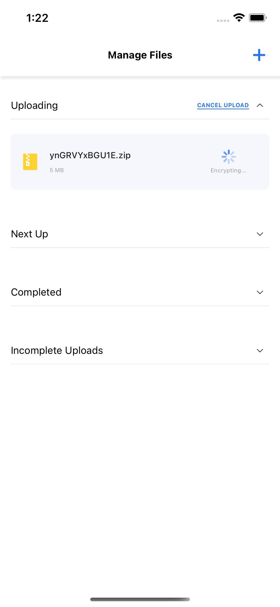
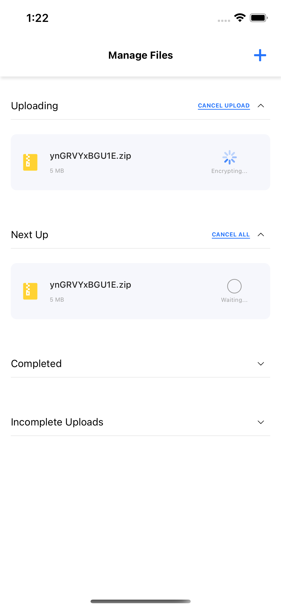
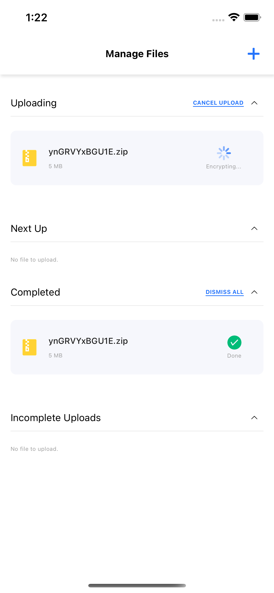
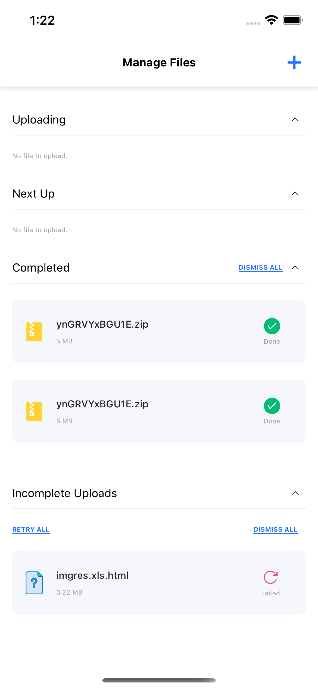

# FireKamp-FileUpload
A short assignment on managing different states while uploading a file

# How to run
1. Clone this repo
2. From root of the project, run
  ```yarn```
3. Next go into `ios` folder and run
  ```pod install```
4. Now run `yarn ios` or `yarn android`

# Libraries Used and Why
1. react-navigation - For basic navigation (However the app is single page, used it as I found that this idea had more scope to it).
2. react-native-document-picker - For document picking from mobile storage. (This is the best supported lib, backed by react native community).
3. react, redux - for global state setup

# A screenshot/gif
1. ;
2. ;
3. ;
4. ;

# What you would do if you had more time
I would have targetted the things which I missed to add due to time crunch. Like:
1. Dismiss all functionality
2. Retry all functionality
3. Failed functionality

Also would have targetted to add the 75% success ratio and add a better solution for queuing up file uploads.
Animations too.
